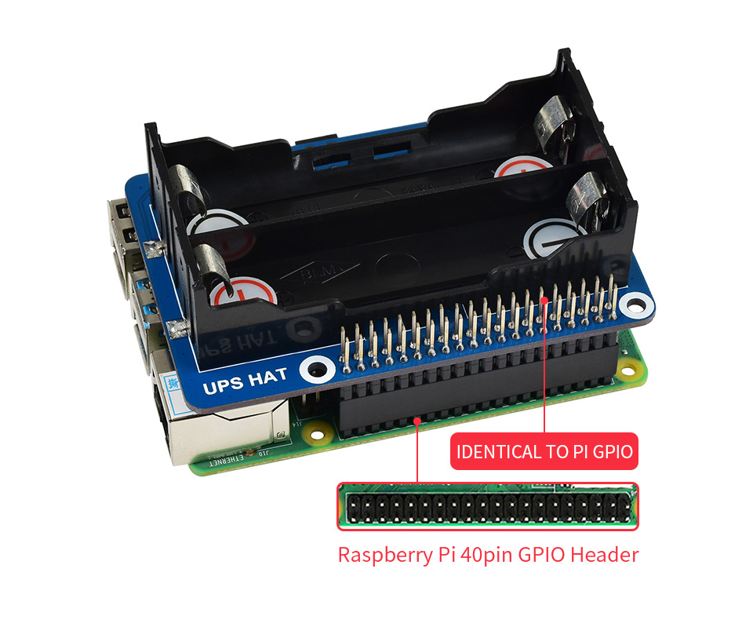
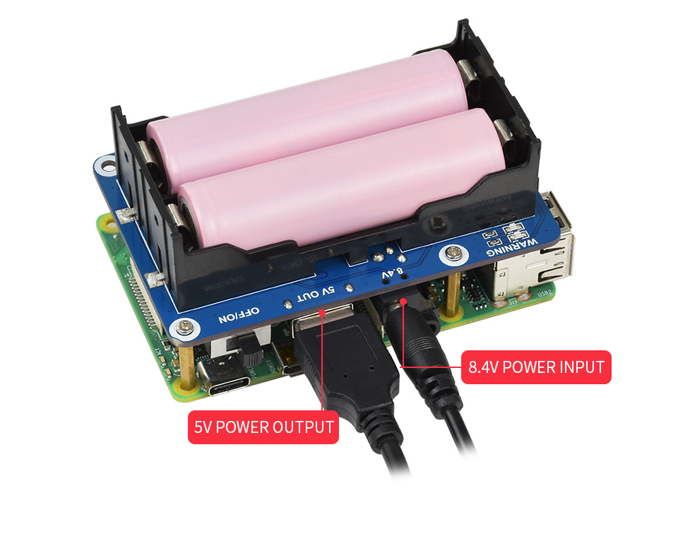
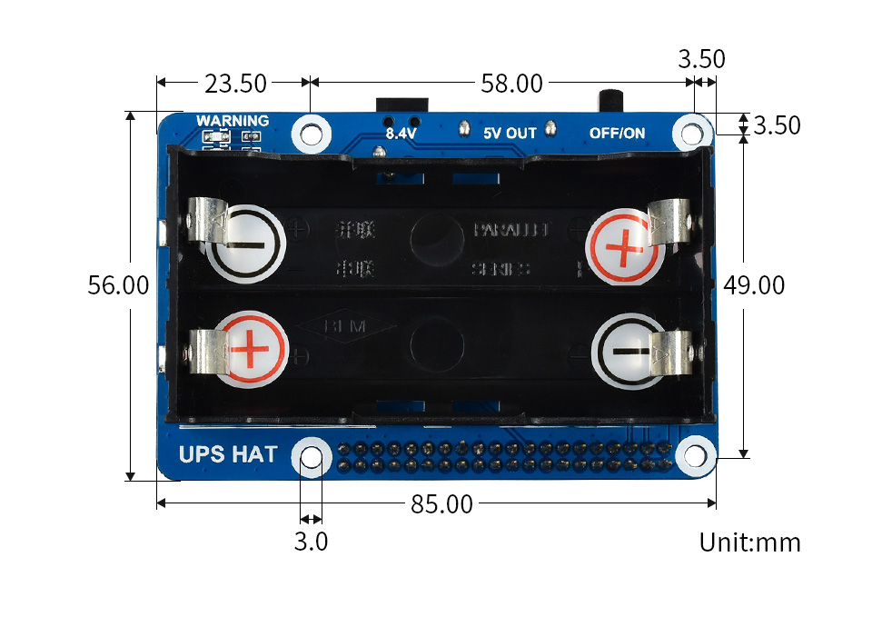

<br />
<div align="left">
  
</div>

<br />

<div align="left">
  
  
  
  
</div>

<br />

#### Module for using the [WaveShare UPS Raspberry Pi Hat](https://www.waveshare.com/product/raspberry-pi/hats/ups-hat.htm) that has an embedded [TI INA219](https://www.waveshare.com/w/upload/1/10/Ina219.pdf)_sensor.
<br />

<div align="center">
  
  
  
</div>

<br />

#### Contents:
<br />

1. [Quick start](#1-quick-start)
2. [Description](#2-description)
3. [Dependencies](#3-dependencies)
4. [Documentation](#4-documentation)
5. [Coverage & Tests](#5-coverage--tests)
6. Examples
7. Measurements
8. Prior art
9. Links to other NI modules
10. Other links

<br />

## 1. Quick start

<br />

```Javascript
yarn install name-industry/ni-ina219
```

<br />

```Javascript
import NI_INA219 from "ni-ina219";

let defaultIC2SensorAddress = 0x42;
let initializeUPS = await NI_INA219.initialize(defaultIC2SensorAddress);

if(initializeUPS.success === true) {
  // Ready
  console.log("Initialized sensor", initializeUPS);
} else {
  // there was an error with the bus and or writing/reading to the device
  console.log("Initialized sensor error", initializeUPS);
}
```

<br />

## 2. Description
<br />
<p align="left">
  <a href="https://skillicons.dev">
    
  </a>
</p>

Uninterruptible Power Supply (UPS) for Raspberry PI. Allows for easily developing projects that could require emergency shutdown or logging during a power outage, giving extra run time when it is needed. 

It uses an 8.4v adapter for charging and has space for 2x 18650 batteries. I was using 2 of these Panasonic [NCR18650B](https://www.orbtronic.com/content/NCR18650B-Datasheet-Panasonic-Specifications.pdf) for testing.

This hat is built and sold by WaveShare. The version this module is written for can be viewed/purchased [here](https://www.waveshare.com/product/raspberry-pi/hats/ups-hat.htm?sku=18306).

The hat uses an embedded INA-219 sensor for reading voltage, current and power along with the ability to set its system configuration to match the system its being installed for. 

This module interacts specifically with the INA-219 on this hat.

<br />

## 3. Dependencies
<br /><br />
Currently for using the example in the ./Example folder and to run tests via Jest, There is included the i2c-bus library found [here](https://github.com/fivdi/i2c-bus). This module ( NI_INA219 ) is not meant to run on its own, but rather controlled via a parent application. Its more like an API exposing services and calls to other applications. When it is feature complete i2c-bus will be removed. Under normal situations the end user will provide the handle to the wire. BigJS deals with issues arising from toFixed in floating point conversions. Not really that much of a problem in this module but nice to have when we are rounding properly for UI displays.
<br /><br />
### 3.1 - 3rd Party Dependencies

| name | description | version |
| - | - | - |
| ic2-bus | NodeJs interface to the I2C bus | ^5.2.2 |
| big.js | Javascript lib to try and keep some fp precision | ^6.2.1 |

### 3.2 - Development Dependencies

| name | description | version |
| - | - | - |
| node | using ES module/class constructs | >= 18 |
| jsDocs | for documentation of the module | ^3.6.11 |
| jest | for unit/integration testing | ^29.2.1 |

various other helper packages:

    - "@babel/core": "^7.19.3",
    - "@babel/preset-env": "^7.19.4",
    - "babel-jest": "^29.2.1",
    - "http-server": "^14.1.1",
    - "jsdoc-template": "braintree/jsdoc-template",
    - "jsdoc-to-markdown": "^7.1.1",
    - "node-cleanup": "^2.1.2",
    - "rimraf": "^3.0.2"

*note: these are only required for developing this module and not for ingest of the module. More details around developing this module in section - ?*

<br />

## 4. Documentation 
<br />
<p align="left">
  <a href="https://skillicons.dev">
    
  </a>
</p>

The module is fully documented with jsDoc within the source as well as the generated docs being included in the Repo. You can pull up the docs at anytime using the small server via Node / Yarn. Creating the docs again is also available.

### 4.1 - View the docs in a browser
<br />

Run this from console.

```Javascript
yarn docs-view
```
*note: when running the server if you are on a different platform ie: remote in via vsCode ssh, that the port forwarding needs to be working since the server boots local*

<br />

### 4.2 Re-create the docs from source
<br />
Output is in ".Docs/NI-INA219". The html in Docs is kept for versioning and adding resources/documents that are persistent.

```Javascript
yarn docs-create
```

<br />

## 5. Coverage & Tests  
<br />
<p align="left">
  <a href="https://skillicons.dev">
    
  </a>
</p>
<br />

Run this from console.

Currently the main NI_INA219 js file is running with tests and outputs coverage. The wrapper for the 3rd party Ic2-Bus module is mocked. The tests are only for returning the correct valid method result shape for data and errors. All methods pass around a value object for modularity.

```Javascript
yarn test
```

Running this will output coverage in the ./coverage folder by default. This will be hoisted into the ./Docs folder to be displayed alongside the main jsDocs.


<br /><br />
<br /><br />
<br /><br />
<br /><br />
(6) Prior Art
This library builds on these two versions:<br />
 <br />
 [WaveShare's Python demo code]{@link https://www.waveshare.com/wiki/UPS_HAT}<br />
  [nodejs version by brettmarl on GitHub]{@link https://github.com/brettmarl/node-ina219}
  <br />
  <br />
  Uses [I2c-bus]{@link https://github.com/fivdi/i2c-bus} temporarily for developing - 
 but will be removed once complete as the module should be provided a promise-based bus 
  on instantiation.<br /><br />
  
